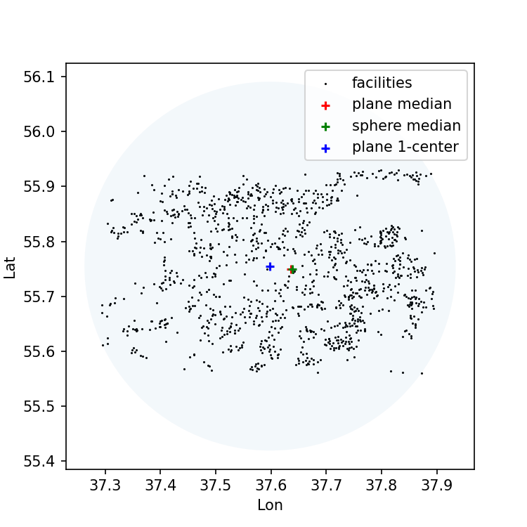

# facility_location



Demo of facility location methods:
* Planar or spherical weighted geometric median.
* Planar 1-center (aka minmax) problem.
```bash
(env) alex@latitude:~/Documents/facility_location$ ./facility_location.py -h
usage: facility_location.py [-h] {median_plane,median_plane_weighted,median_sphere,median_sphere_weighted,one_center_plane} filename

Solve the facility location problem.

positional arguments:
  {median_plane,median_plane_weighted,median_sphere,median_sphere_weighted,one_center_plane}
                        method
  filename              csv input file describing the facilities with format lat,lon[,weight]

options:
  -h, --help            show this help message and exit
```

Example run (file `5ka_moscow.csv` contains coordinates of "5ka" grocery store chain locations):
```
(env) alex@latitude:~/Documents/facility_location$ ./facility_location.py median_sphere_weighted 5ka_moscow.csv 
55.749998820502185,37.639150378140215
```

TODO:
* Live demo with deck.gl
